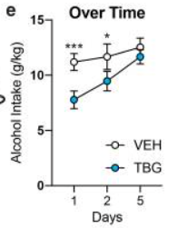

## 1. Introduction & Biological Question

Serotonergic psychedelics such as psilocybin and LSD as well as atypical psychedelics like **ibogaine** have proven to be profoundly effective in treating neuropsychiatric disorders, including substance use disorders. However, their therapeutic use is limited by their intense hallucinogenic side effects and, in the case of ibogaine, the risk of fatal cardiac arrhythmias through inhibition of the hERG potassium channel.

In order to overcome these barriers, the Olson Lab at the University of California, Davis developed **tabernanthalog (TBG)**, a water-soluble, non-hallucinogenic, and non-toxic analogue of ibogaine. TBG retains the neural plasticity properties of ibogaine while eliminating hallucinogenic effects and cardiac toxicity (Cameron et al., 2021).
      
In this computational reanalysis and visual redesign, I utilize raw, unpolished behavioral data deposited on Figshare (ID: 11634795) from the seminal publication:
      
 > Cameron, L.P., Tombari, R.J., Lu, J. *et al.* A non-hallucinogenic
      psychedelic analogue with therapeutic potential. *Nature* **589**,
      474–479 (2021).  [https://doi.org/10.1038/s41586-020-3008-z](https://doi.org/10.1038/s4158
  6-020-3008-z)

My main objective is to audit figure 4e (Alcohol Intake Over Time), verifying whether a single administration of TBG (10 mg/kg) significantly reduces daily alcohol consumption in mice across multiple days. Additionally, I aim to replicate the published figure and attempt to improve clarity by replacing the original **dynamite plot** a with high-density visualization that reveals the underlying variability between mice. 

## Raw Data Import
First, I loaded the packages I needed throughout this project. Not all packages contained within `tidyverse` were used; I loaded the entire package out of convenience. I used `here()` to ensure the file path constructed would be located correctly regardless of the working directory or machine in use. The imported object was named `raw_data` and `dim()` was used to confirm the success of import. 

```{r}
#load packages
library(tidyverse)
library(pzfx)
library(here)
#import raw data using 'here()' to find project root
raw_data <- read_pzfx(
  here("data/raw/extracted/Final Data for Publication/Fig 4e_Alcohol over time copy.pzfx"),
  table = "Data 1"
)
#print raw dimensions to verify import
dim(raw_data)
#- 3 rows, 39 columns
```
## Wrangle Data
Once the data was imported, the next step was tidying and transforming, which I labeled as 'Wrangle Data' since there was not enough transforming required to create a dedicated section. I started previewing with `glimpse()` and found that the data frame was very wide, all value assignments were `<dbl>`, the `ROWTITLE` column contained time points, and there were no `NA` values; making tidying simple. To adjust the data frame to the tidy (long) format I used `pivot_longer` and set new column names. Since the later 2-way ANOVA requires 3 distinct variables, I used `separate_wider_delim()` to isolate `VEH` and `TBG` as the `treatment` variable and the number (1-19) as the `mouse_id` variable. This step was kept separate within the pipe to avoid mistakes that may occur when attempting to lengthen data and split a string in the same step. The only transformation required was the last `mutate()` step where I set `treatment` to be a factor since that's what the ANOVA test works with. I set 'mouse_id" as an integer since that automatically sorts by numerical order and because `<int>` excludes erroneous characters I might have missed that would cause errors later in the 2-way ANOVA. 

```{r}
#preview raw_data 
glimpse(raw_data)
#observations:
#- 3 rows, 39 columns (wide data frame)
#- no "NA" values
#- all values <dbl>
#- column: "ROWTITLE" contains time points "1, 2, 5" 
#- 38 columns represent indiv mice replicates "VEH_n" & "TBG_n" (where 1<=n<=19)
#- mice columns contain daily alcohol intake (g/kg) data 
#tidy based on observations
tidy_data <- raw_data |> 
  pivot_longer(
    cols = -ROWTITLE,
    names_to = "mice_replicates",
    values_to = "alcohol_intake"
  ) |>
#rename column containing time points
  rename(day = ROWTITLE) |>
#split column "mice_replicates" 
  separate_wider_delim(
    cols = mice_replicates,
    delim = "_",
    names = c("treatment", "mouse_id")
  ) |> 
#change variable type to: treatment <fct> & mouse_id <int>
  mutate(
    treatment = as.factor(treatment),
    mouse_id = as.integer(mouse_id)
  )
#check to see that changes were made
print(tidy_data)
```

## Replication of Fig.4e: Alcohol Intake Over Time 
Before graphing I needed to perform some temporary transformations on `tidy_data` in order to replicate the exact coordinates and error values used in the published figure. I chose to include this step here rather than in the 'Wrangle Data' section, since the transformations made are not reused elsewhere. The published figure has an X-axis divided into three days, color representing treatment, and alcohol intake on the Y-axis, so I used `group_by()` on 'day' and 'treatment', and `mean()` to calculate the Y-axis values. The next two steps; `sd()` and `n()` were needed to calculate **Standard Error of the Mean** (SEM) used for error bars. Finally, I used `ungroup()` to ensure these grouped changes did not persist into later steps. 

The figure itself is not complex, but much iteration was required to replicate the exact conventions used in the original. I used `as.factor()` every time `day` was referenced in order to maintain even spacing between days on the X-axis as seen in the published figure. Within `geom_line` I used `position_dodge()`, a slight deviation from the published figure, to prevent the error bars from overlapping. Later, I also used `annotate()` to add the `*` significance indicators seen in the published figure, despite not yet having confirmed significance myself via ANOVA; all specific position values were estimated visually to approximate their placement in the original. I chose to use `coord_cartesian()` instead of `limits = c(0, 15)` to prevent the silent loss of data points or error bars that fall outside the specified range. Lastly, the labels section was a challenge for me as I have not yet learned how to correctly change text alignment and figure aspect ratio. I acknowledge that the `TBG` error bars are blue in my replication. 

```{r}
#group and summarize data 
summary_data <- tidy_data |> 
  group_by(day, treatment) |> 
  summarise(
    mean_intake = mean(alcohol_intake),
    sd_intake = sd(alcohol_intake),
    n = n(),
    sem_intake = sd_intake / sqrt(n)
  ) |> 
  ungroup()
#check changes 
print(summary_data)
#- changes made
#replicate figure using summary_data 
replication_plot <- ggplot(
  summary_data,
  aes(
      x = as.factor(day),
      y = mean_intake,
      group = treatment,
      fill = treatment,
      color = treatment
  )
) +
#treatment lines
  geom_line(
    position = position_dodge(.2),
    linewidth = 1 
  ) +
#SEM error bars
  geom_errorbar(
    aes(
      ymin = mean_intake - sem_intake,
      ymax = mean_intake + sem_intake
    ),
    width = .1,
    position = position_dodge(.2),
    linewidth = .8
  ) + 
#filled points
  geom_point(
    shape = 21,
    size = 4,
    color = "black",
    stroke = 1,
    position = position_dodge(.2)
  ) +
#color mapping 
  scale_fill_manual(values = c("VEH" = "white",
                               "TBG" = "steelblue")) +
  scale_color_manual(values = c("VEH" = "black",
                                "TBG" = "steelblue")) +
#add signif * (assumed signif at this point)
  annotate(
    geom = "text",
    x = c(1, 2),
    y = c(12.5, 13.5),
    label = c("***", "*"),
    size = 6,
    color = "black"
  ) +
#zooming without cut off error bars 
  coord_cartesian(
    ylim = c(0, 15)) +
  scale_y_continuous(
    breaks = seq(0, 15, 5)) +
#add labels 
  labs(
    x = "Days",
    y = "Alcohol Intake (g/kg/day)",
    title = "Recreation of Figure 4e"
  ) +
  theme_classic()
#display figure
print(replication_plot)
```
## Published Figure
::: {layout-ncol=2}

:::
## Statistical Validation 
I fit a **2-way repeated measures ANOVA (analysis of variance)** here to test the visual suggestion above that; alcohol intake differs significantly by 'treatment', by day, and if the two factors interact (why I use `*` not `+`). `Error(as.factor(mouse_id))` was used to account for the multiple tests preformed each day; this is what makes it a 'repeated measures' ANOVA. ANOVA models don't use a pipe so `data =` is required. 

```{r}
#fit 2-way repeated measures ANOVA test 
anova_model <- aov(
  alcohol_intake ~ treatment * as.factor(day) +
Error(as.factor(mouse_id)),
  data = tidy_data 
  )
#print model
summary(anova_model)
```
## ANOVA Conclusion
- 'treatment' -> significant (p < .001, ***): TBG reduced alcohol intake overall.

- 'day' -> significant (p < .001, ***): intake changed across days, regardless of treatment.

- 'treatment', 'day' interaction -> not significant (p = .117)

The test above yielded three statistical findings; 
'treatment' effect is very significant. Mice treated with a single dose of TBG consumed significantly less alcohol than vehicle-treated controls across the timeline. The primary therapeutic claim is fully supported. 
'day' effect is very significant. Regardless of treatment, overall alcohol consumption changed significantly over time.
The 'treatment' and 'day' interaction is not statistically significant.

The original publication figure shows a convergence between 'treatment' over time, implying that TBG's efficacy fades over time. However, the non-significant interaction term cannot confirm this pattern. This does not yet serve as contradiction to the published figure but warrants the use of a **post-hoc** test to investigate how the authors derived their daily significance markers.

## Post-Hoc TukeyHSD
`TukeyHSD()` (Honest Significance Difference) is a standard post-hoc (follow up) test for ANOVA, that corrects for a false positive risk from running multiple pairwise comparisons at once. Because the previous ANOVA's interaction term was not significant I fit a new ANOVA without `Error()`. I used `tidy()` from the `broom` package to convert the `TukeyHSD()` output to a readable data frame. Then, I filtered for the three 'VEH' v.s. 'TBG' comparisons of interest.

```{r}
#load 'broom' for the 'tidy' function
library(broom)
#fit a simple ANOVA
posthoc_model <- aov(
  alcohol_intake ~ treatment * as.factor(day),
  data = tidy_data)
#feed the turkey!
tukey_tidy <- tidy(TukeyHSD(posthoc_model))
#filter for comparisons of interest 
tukey_tidy |> 
  filter(
    contrast %in% c(
      "VEH:1-TBG:1",
      "VEH:2-TBG:2",
      "VEH:5-TBG:5"
    )
  ) |>
select(
  contrast,
  estimate,
  adj.p.value
)
  
```
## Post-Hoc Conclusion 
Using the conservative post-hoc Tukey HSD test, none of the day-specific treatment comparisons (VEH vs. TBG) reached statistical significance. Day one was closest to reaching significance. 
Hope is not lost, I will now apply the exact methodology used in the publication to determine significance; **Sidak Multiple Comparisons Test**

## Sidak Multiple Comparisons Test 
Sidak was a new technique to me before starting this project and I cannot say that I fully understand it yet, but since the ANOVA + TukeyHSD workflow was unsuccessful in reproducing the results seen in the publication figure, I attempted to follow their native protocol. I used `emmeans()` which is used to extract estimated marginal means for 'treatment' within each day. I fed in the repeated measures ANOVA from before since, unlike `TukeyHSD()`, 'Sidak' works with repeated measures. Again, `tidy()` converts the results into a readable data frame.

```{r}
#load emmeans package 
library(emmeans)
#extract estimated marginal means from the 2-way repeated ANOVA earlier 
marginal_means <-  emmeans(
  anova_model, ~ treatment | day)
#use Sidak for pairwise comparisons
sidak_contrasts <- pairs(
  marginal_means, adjust = "sidak"
)
#use tidy and print contrasts 
tidy(sidak_contrasts) |> 
  select(
    contrast, day, estimate, std.error, statistic, p.value
  )
```
## Sidak Conclusion
This test has proven to reproduce the published figure's pattern exactly. High significance at day 1 (p < .001) and reduced significance on day 2 (p < .05), corresponding to the pattern of convergence between treatments over time seen in the published figure.

## Improved Figure 
```{r}

```


